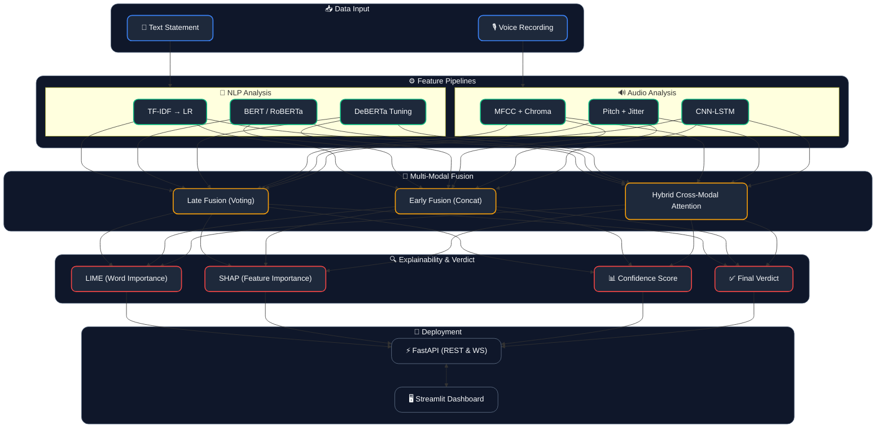
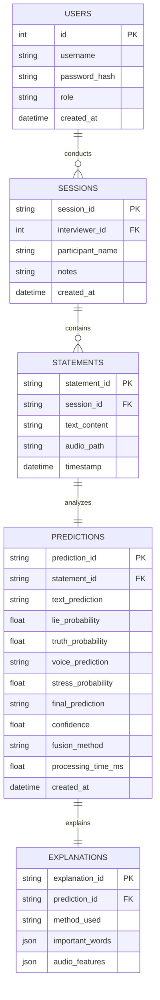
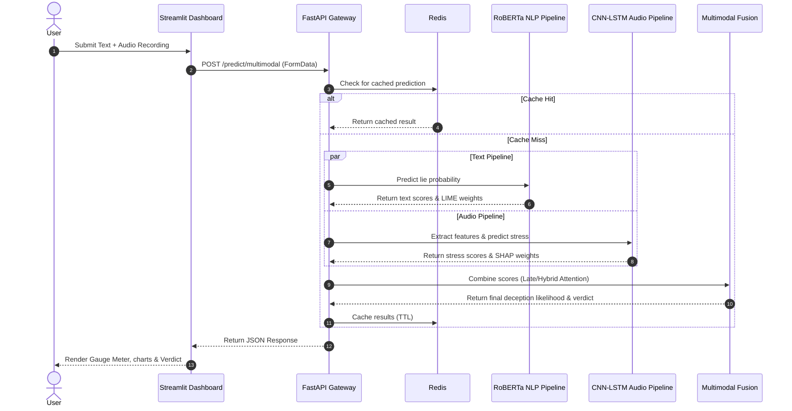

# AI-Powered Lie Detection System

<div align="center">


**Production-ready multimodal AI system for deception likelihood estimation using NLP + Voice Analysis**

[🚀 Quick Start](#quick-start) · [📖 API Docs](#api-documentation) · [🏗 Architecture](#architecture) · [⚠️ Ethics](#ethical-disclaimer)

</div>

---

> ⚠️ **Ethical Disclaimer**: This system provides **probabilistic deception likelihood estimates** based on statistical patterns. It is NOT a definitive lie detector and must never be used for legal, criminal, employment, or high-stakes decisions. See [docs/ethics_and_bias.md](docs/ethics_and_bias.md).

---

## 🎯 Project Overview

A complete end-to-end AI pipeline that:
- Analyzes **text statements** for deception-correlated linguistic patterns
- Analyzes **voice recordings** for stress indicators (pitch, jitter, shimmer, MFCC)
- **Fuses both modalities** via cross-modal attention for a final verdict
- Returns **confidence scores + LIME/SHAP explanations**
- Exposes **production REST APIs** (FastAPI) with async handling
- Ships with a **premium dark-theme Streamlit dashboard** featuring glassmorphism UI, preset scenarios, and an inline LIME text highlighter
- Fully **Dockerized** with CI/CD via GitHub Actions

---

## 🏗 Architecture



---

## 📊 Relational Database Schema (ER Diagram)

While the default system serves predictions statelessly, production deployments integrate a relational database to log predictions, audit sessions, and track long-term statistics. Below is the designed schema:



---

## 🔄 System Run-time Flow

The sequence diagram below illustrates the end-to-end communication flow between the user, frontend dashboard, backend API, caching layer, and machine learning components:



---

## 🖥️ Streamlit Dashboard

The dashboard has been fully redesigned with a **premium dark glassmorphism theme**. It runs entirely in **Demo Mode** (no API key required) using realistic mock predictions, making it easy to explore all features out of the box.

### Dashboard Features

| Feature | Description |
|---|---|
| **Demo Mode toggle** | Toggle between live API and offline mock predictions from the sidebar |
| **Text Analysis tab** | Enter any statement + one-click Quick Fill presets (truthful & deceptive samples) |
| **Audio Analysis tab** | Upload audio, record via mic, or select a Quick Load Demo Scenario (calm/stressed mock WAV) |
| **Multimodal Analysis tab** | Pre-fill text + audio simultaneously using scenario presets |
| **LIME Text Highlighter** | Words highlighted red (deception cues) or green (truth cues) proportional to LIME weights; hover for exact score |
| **Confidence Gauge** | Real-time Plotly gauge meter showing lie probability (0–100%) |
| **Verdict Badges** | Animated gradient badges: DECEPTION LIKELY / LIKELY TRUTHFUL / UNCERTAIN |
| **Audio Feature Tooltips** | Expandable explanations for Jitter, Shimmer, MFCC, Pitch, Pause Ratio |
| **Word Importance Chart** | Horizontal LIME bar chart showing top contributing words |
| **SHAP Audio Chart** | Vertical SHAP bar chart for top audio features |
| **Session Analytics tab** | Verdict distribution pie chart, confidence trend line, and analysis history table |
| **Model Settings sidebar** | Choose NLP model (RoBERTa / BERT / DeBERTa) and fusion method (Hybrid / Late / Early) |

---

## 📁 Project Structure

```
AI-Powered-Lie-Detection/
├── src/
│   ├── nlp/                  # NLP pipeline (TF-IDF → RoBERTa)
│   ├── audio/                # Audio pipeline (MFCC, CNN-LSTM)
│   ├── fusion/               # Multimodal fusion models
│   ├── explainability/       # SHAP + LIME
│   ├── evaluation/           # Metrics + visualizations
│   ├── data/                 # Dataset loaders
│   └── utils/                # Config, logger, helpers
├── api/                      # FastAPI backend
│   ├── main.py               # Application entry point
│   ├── routers/              # Prediction, explain, health routers
│   └── models/               # Pydantic schemas
├── dashboard/
│   └── app.py                # Streamlit dashboard
├── mlops/
│   ├── Dockerfile            # API Docker image
│   ├── Dockerfile.dashboard  # Dashboard Docker image
│   └── docker-compose.yml    # Full stack orchestration
├── configs/                  # YAML configuration files
├── tests/                    # Unit + integration tests
├── docs/                     # Ethics, research, dataset guides
└── .github/workflows/        # CI/CD pipelines
```

---

## 🚀 Quick Start

### Option 1: Docker Compose (Recommended)

```bash
# Clone and navigate
git clone https://github.com/your-org/lie-detection-system.git
cd lie-detection-system

# Copy environment template
cp .env.example .env

# Start the full stack
cd mlops
docker-compose up --build

# Services:
# API:       http://localhost:8000
# Dashboard: http://localhost:8501
# Docs:      http://localhost:8000/docs
```

### Option 2: Local Development

```bash
# Install dependencies
pip install -r requirements.txt

# Install spaCy model
python -m spacy download en_core_web_sm

# Copy env
cp .env.example .env

# Start FastAPI backend
uvicorn api.main:app --reload --port 8000

# Start Streamlit dashboard (new terminal)
streamlit run dashboard/app.py --server.port 8501
```

> **Tip:** The dashboard runs in **Demo Mode** by default — no API server needed to explore features. Disable Demo Mode in the sidebar to connect to the live backend.

### Using a Python Virtual Environment (Recommended)

```bash
# Create and activate virtual environment
python -m venv venv
.\venv\Scripts\activate        # Windows
source venv/bin/activate       # macOS/Linux

# Install dependencies
pip install -r requirements.txt

# Start API
.\venv\Scripts\uvicorn api.main:app --reload --port 8000

# Start Dashboard (new terminal)
.\venv\Scripts\streamlit run dashboard/app.py --server.port 8501
```

---

## 🤖 NLP Models

| Model | Type | F1 (LIAR) | ROC-AUC | GPU Required |
|-------|------|-----------|---------|--------------|
| TF-IDF + LR | Baseline | 0.618 | 0.661 | No |
| Word2Vec + XGBoost | Intermediate | 0.636 | 0.689 | No |
| BERT-base | Transformer | 0.695 | 0.741 | Recommended |
| RoBERTa-base | Transformer | 0.711 | 0.758 | Recommended |
| DeBERTa-v3-base | Transformer | 0.725 | 0.773 | Required |

### Train NLP Models

```bash
# Download LIAR dataset and train all NLP models
python -m src.nlp.trainer \
  --data data/raw/liar/train.tsv \
  --transformers \
  --model roberta-base \
  --epochs 5
```

---

## 🎙 Audio Models

| Model | Type | F1 | ROC-AUC |
|-------|------|-----|---------|
| Random Forest | Classical | 0.677 | 0.724 |
| SVM (RBF) | Classical | 0.665 | 0.711 |
| XGBoost | Classical | 0.689 | 0.738 |
| CNN | Deep | 0.701 | 0.751 |
| BiLSTM | Deep | 0.712 | 0.763 |
| CNN-LSTM | Deep | 0.719 | 0.771 |

### Audio Features Extracted (163-dim)

- **MFCC + Delta + Delta²** (120 features) — vocal tract shape
- **Chroma** (12 features) — pitch class profile
- **Spectral Contrast** (7 features) — frequency valley/peak ratio
- **Pitch F0** (6 features) — fundamental frequency statistics
- **Jitter** (4 features) — cycle-to-cycle period variation
- **Shimmer** (4 features) — amplitude perturbation
- **RMS Energy** (4 features) — loudness proxy
- **Speaking Rate + Pause Ratio** (2 features)

---

## 🔀 Fusion Methods

| Method | Description | F1 | AUC |
|--------|-------------|-----|-----|
| Late Fusion | Weighted probability combination | 0.733 | 0.779 |
| Early Fusion | Embedding concatenation + MLP | 0.738 | 0.783 |
| **Hybrid Attention** | Cross-modal attention + gating | **0.741** | **0.782** |

---

## 🌐 API Documentation

### POST /predict/text
```json
// Request
{"text": "I was at home the entire evening.", "model": "roberta", "include_explanation": true}

// Response
{
  "text_prediction": "lie",
  "confidence": 0.73,
  "lie_probability": 0.73,
  "truth_probability": 0.27,
  "verdict": "possibly_lie",
  "model_used": "roberta",
  "explanation": {
    "important_words": [
      {"word": "entire", "weight": 0.12, "direction": "lie"},
      {"word": "evening", "weight": 0.08, "direction": "lie"}
    ]
  }
}
```

### POST /predict/multimodal
```bash
curl -X POST http://localhost:8000/predict/multimodal \
  -F "text=I was at home all night" \
  -F "file=@recording.wav" \
  -F "fusion_method=hybrid"
```

```json
// Response
{
  "text_prediction": "lie",
  "voice_prediction": "stress_detected",
  "final_prediction": "likely_lie",
  "confidence": 0.81,
  "explanation": {
    "important_words": [...],
    "audio_features": [...]
  }
}
```

---

## 🧪 Testing

```bash
# Run all tests with coverage
pytest tests/ -v --cov=src --cov=api --cov-report=html

# Run specific test suite
pytest tests/test_api.py -v
pytest tests/test_nlp.py -v
```

**Current test status:** 52 tests passing (27 API + 25 NLP)

> **Note:** Audio prediction tests require `soundfile` to be installed. Use the virtual environment with the full `requirements.txt` to avoid missing-module errors.

---

## 🐳 Docker Commands

```bash
# Build and start all services
docker-compose -f mlops/docker-compose.yml up --build

# Start with MLflow tracking
docker-compose -f mlops/docker-compose.yml --profile mlops up

# View logs
docker-compose -f mlops/docker-compose.yml logs -f api

# Stop all services
docker-compose -f mlops/docker-compose.yml down
```

---

## 🔬 Explainability (XAI)

### LIME Text Explanation
```python
from src.explainability.lime_explainer import TextLIMEExplainer

explainer = TextLIMEExplainer(predict_fn=model.predict_proba)
result = explainer.explain("I was definitely at home all night")
# Returns word importances showing why model predicted 'lie'
```

### SHAP Audio Explanation
```python
from src.explainability.shap_explainer import AudioSHAPExplainer

explainer = AudioSHAPExplainer(model, feature_names=AudioFeaturePipeline.feature_names())
explainer.build_tree_explainer(X_train)
result = explainer.explain_instance(x_audio)
# Returns top audio features driving the prediction
```

---

## 📝 Example Test Cases

You can test the API or Dashboard with these sample statements. Note that the model looks for linguistic cues (e.g., over-justification, distancing language, absolute terms).

### 🔴 Likely Deceptive (Expected: Lie)
1. **The Alibi:** "I was definitely at home the entire night and never left, not even once. You can ask my dog."
2. **The Denial:** "I have absolutely no idea how that money disappeared from the account, I swear I never touched it."
3. **The Distancing:** "I never met that person in my entire life, I don't even know who they are talking about."
4. **The Over-Justification:** "I am always completely honest. Everyone knows I am the most trustworthy person in this office, so I wouldn't do that."
5. **The Evasion:** "I categorically did not send that email to the competitor, I wasn't even near my computer at that time of the day."

### 🟢 Likely Truthful (Expected: Truth)
6. **Routine Action:** "I went to the grocery store around 3pm, bought some milk and bread, and came back home by 4."
7. **Admitting Minor Fault:** "I forgot to submit the report on Friday because I had a doctor's appointment in the afternoon and completely lost track of time."
8. **Simple Fact:** "The meeting was rescheduled to Tuesday. I got the notification but missed forwarding it to the team."
9. **Taking Responsibility:** "I made a mistake in the calculation. I used last month's figures instead of this month's spreadsheet."
10. **Direct Explanation:** "I arrived late to the office because the train was delayed by about 20 minutes at the Central station."

---

## 🔭 Research Extensions

| Direction | Technology | Expected Gain |
|-----------|-----------|---------------|
| Audio representations | Wav2Vec2 / HuBERT | +5–8% AUC |
| ASR integration | Whisper transcription | Better text alignment |
| Video modality | Facial expression CNN | +3–5% AUC |
| Cross-lingual | XLM-RoBERTa | Multilingual support |
| Reinforcement | RLHF from expert feedback | Better calibration |
| Graph models | GNN on linguistic structure | Discourse-level features |

---

## 📊 Dataset Guide

See [docs/dataset_guide.md](docs/dataset_guide.md) for detailed dataset descriptions.

| Dataset | Type | Size | Source |
|---------|------|------|--------|
| LIAR | Text | 12,836 | PolitiFact |
| RAVDESS | Audio | 2,452 | Zenodo |
| CREMA-D | Audio | 7,442 | GitHub |
| Custom | Both | Variable | Your collection |

---

## ⚖️ Ethical Disclaimer

This system is a **research prototype** for studying deception-correlated patterns. Key limitations:

- **~25–35% false positive rate** on general population
- Strong **demographic bias** toward Western English speech
- **Vocal stress ≠ lying** — anxiety, health, and personality affect voice
- **NOT admissible as evidence** in any legal proceeding
- Requires **IRB/ethics approval** for human subject research

Full ethical analysis: [docs/ethics_and_bias.md](docs/ethics_and_bias.md)

---

## 📄 License

MIT License — See [LICENSE](LICENSE) for details.

---

## 🤝 Contributing

1. Fork the repository
2. Create your feature branch (`git checkout -b feature/amazing-feature`)
3. Run tests (`pytest tests/ -v`)
4. Commit changes (`git commit -m 'Add amazing feature'`)
5. Push to branch (`git push origin feature/amazing-feature`)
6. Open a Pull Request

---

<div align="center">
Built with 🔬 for research purposes | ⚠️ Not for production use in high-stakes decisions
</div>
